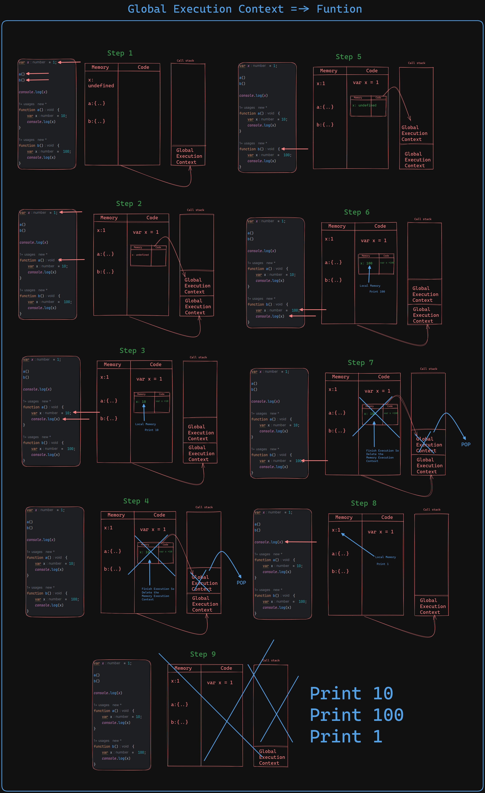

- 1:
    - **execution context**✅
    - **call stack**✅
    - **hoisting**✅
    - **Function work flow**✅
    - **Windows and this**✅
    - **Undefined and not defined**✅
    - **scope and lexical environment**
    - **function scope and lexical object**
    - **block scope and shadowing**
    - **module scope and global object**
    - **closure**
- 2:
    - **object reference and shallow copy**
    - **deep copy and methods**
    - **private and public properties**
    - **getter and setter**
    - **constructor, prototype, and methods**
    - **native prototype and primitive as object**
- 3:
    - **prototypical inheritance**
    - **class syntax and static properties**
    - **inheritance and encapsulation**
    - **this and this binding issue**
    - **call, apply, and bind methods**
    - **NFE and IIFE**
- 4:
    - **higher order function and callback**
    - **map, filter, and reduce methods**
    - **array-like and iterable objects**
    - **iterator protocol and generator function**
    - **async generator and async iterator**
    - **promise and async/await**
- 5:
    - **try/catch and error handling**
    - **callback hell and promise chaining**
    - **event loop**
    - **event handling and bubbling**
    - **event delegation and target**
    - **js keyboard event and js submit event**
- 6:
    - **composition and currying**
    - **memorization and caching**
    - **debouncing and throttling**
    - **spread and rest operators**
    - **short circuiting and nullish coalescing operator**
    - **computed property names and destructuring**
- 7:
    - **map, set, and array methods**
    - **flat and flatMap methods**
    - **WeakMap and WeakSet**
    - **sorting array and compare function**
    - **query selector and DOM manipulation**
    - **regular expression and string methods**
- 8:
    - **Extra**

----


###  Execution Context
`Everything in JavaScript happens inside an execution context.`

It has two components:
- Memory Component(variable environment)
- Code Component (thread of execution)

In the memory component, it stores all the variables and function declarations in key-value pairs. 

In the code component, it executes the code line by line.

So we can say javascript is `synchronous and single-threaded language`.
Means it can execute one command at a time and in a specific order.

What happens when we run a javascript code?
- When we run a javascript code, it creates a global execution context.

This will happen in two phases:
- Creation Phase
- Execution Phase


----

### Call Stack

Call Stack, also known as Execution Context Stack/Program Stack/control stack/run-time stack/ machine stack

`Call stack used to manage the execution context.` 

whenever we run a javascript code, it creates a global execution context and pushes it to the call stack. 
And when the execution context is finished, it pop it from the call stack.
----
### Hoisting

`Hoisting is JavaScript's default behavior of moving all declarations to the top of the current scope.`

```js
console.log(a); // undefined
var a = 10;
```
- In the first line, you might expect a ReferenceError since myVar is not yet declared. But due to hoisting, JavaScript already knows about myVar declaration, but not its initialization. So, it gives undefined.


```js
sum(10, 10); // 20
function sum(a, b) {
  return a + b;
}
```
- In the first line, you might expect a ReferenceError since sum is not yet declared. But due to hoisting, JavaScript already knows about sum declaration, but not its initialization. So, it gives undefined.

```js
sum(10, 10); // TypeError: sum is not a function

var sum = (a, b) => {
  return a + b;
}
```

- It behave like another variable declaration. So, it gives undefined.

____

### Extra Info 1

#### Object Creation Techniques

1. `abc[price] = asc`: This is used when you already have an object (`abc` in this case) and you want to add a new property (`price`) to it or modify the value of an existing property. The `=` is the assignment operator.

```javascript
let abc = {}; // An empty object
let price = 'price';
let asc = 'asc';
abc[price] = asc; // Now, abc is {price: 'asc'}
```

2. `{[price]: asc}`: This is used when you're creating a new object and you want to set its properties dynamically. The `:` is used in object literal syntax to separate property names from their values.

```javascript
let price = 'price';
let asc = 'asc';
let abc = {[price]: asc}; // Now, abc is {price: 'asc'}
```

In both cases, you end up with an object `abc` that has a property `price` with a value of `'asc'`. The difference is in when and how you use each syntax. The first is used for modifying existing objects, and the second is used for creating new objects with dynamic properties.

----
### Function work flow

- Function Invocation
```js
var x = 1;

a()
b()

console.log(x)

function a() {
    var x = 10;
    console.log(x)
}

function b() {
    var x =  100;
    console.log(x)
}

```


### Windows and this

- In JavaScript, the `window` object is the global object in a browser environment. It's created by the JavaScript engine when you run a script in the browser.
- When you run a JavaScript file, even if it's empty, an execution context is created with the `window` as the global object.
- Any variable or function declared outside a function is in the global space, and is attached to the `window` object.
- Variables declared inside a function are not in the global space. They are local to the function and cannot be accessed outside the function.

Here's a small example:

```javascript
var a = 10; // This is a global variable

function b() {
  var x = 10; // This is a local variable
}

console.log(window.a); // Outputs: 10
console.log(this.a); // Outputs: 10
console.log(window.x); // Outputs: undefined
console.log(this.x); // Outputs: undefined
```

In this example, `a` is a global variable and can be accessed as a property of the `window` object or with `this` keyword. However, `x` is a local variable inside function `b` and is not accessible as a property of the `window` object or with `this` keyword. It's `undefined` in the global context.
